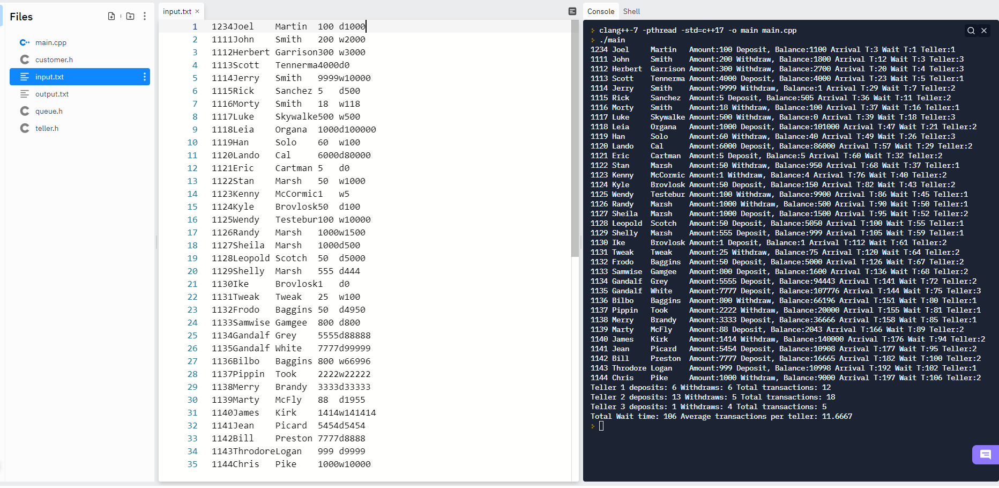

# Data Structures 6
## Assignment 6 for Data Structures class as Northeastern State University

##Simulates a bank queue with 3 tellers conducting transactions

The program takes input for a text file. The text file is filled with account information along with transactions to be done on each account. This information is input into a data structure called **customer**. Each customer has an ID number, first name, last name, amount in the transaction, transaction type as a character, previous account balance, along with their arrival time, service time, and the number of the teller who helped them. Each line of input has the same structure. For example the first four characters of each line is the customer's ID number, and the next eight characters are the customer's first name (ignoring empty space).

#### Customer struct
```
struct customer{
int ID = 0;
std::string fname = "default";
std::string lname = "default";
double amount = 0;
char transType = 'o';
double balance = 0;
int atime = 0; // arrival time
int stime = 0; // service time
int TellerNo = 0; // Teller number
};
```

The program starts by generating the random seed, since many of the times are randomly generated. The array of customers is initialized, along with a pointer which will be used to reference, and make changes to it. The array of customers it filled, using input from *input.txt* to fill the values. The tellers and queue are initialized. The customers which were stored in the array are then placed into a queue, with the first customer in the array being placed at the front of the queue, and the rest following in the same order. The queue, and tellers are passed to the function, along with two integers, which will keep tract of the times of each transaction. This function executes the transactions, and makes the declared changes to each account. A report is then generated showing the post transaction customer information, what transactions took place, information about the tellers, total time of the transactions, and the average transactions completed by the tellers. All output is printed to the **output.txt** file, and to the console.

#### Screenshot of the input file, and output to the console.

